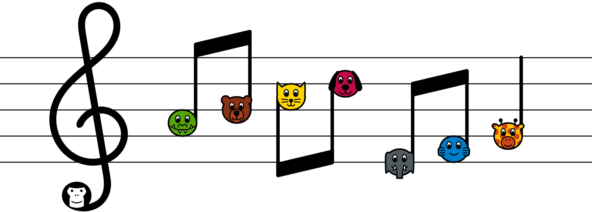

Comming soon: Open source sheet music library, tools to create your own sheet music, iOS app and much more - all free.

### Languages

AnimalNoteHeads currently supports English, French, Spanish and Danish. I'll be adding more as you [tell me the names](https://github.com/andreaslarsen/animalnoteheads/issues/6) in your language.

### [PDF](assets/pdf/) Piano Guides

Print, cut and put them behind the keys. Octave length on your piano divided by 165mm (6.5") equals print scale - e.g. 99mm / 165mm = 60%.

### Help/Support Me

* Thanks for every tweet, like, star, pin and forum post:)
* Be my [patreon](https://www.patreon.com/andreaslarsen) for a small monthly amount.  
* Buy from [redbubble.com/people/animalnoteheads/shop/](http://www.redbubble.com/people/animalnoteheads/shop/)
  * 4$ vinyl stickers for 2 octaves (EN, FR, ES, DK)
  * Posters and maybe [other ideas](https://github.com/andreaslarsen/animalnoteheads/issues/9) soon.

### Contributors

 You? - Ideas, questions, translations, code, beta tests etc. at [GitHub](https://github.com/andreaslarsen/animalnoteheads/issues)  
 [Abraham Lee](http://fonts.openlilylib.org) - Lilypond expert  
 [Tobias Due Munk](https://twitter.com/tobiasdm) - iOS developer  
 Andreas Larsen - I love open source [projects](https://github.com/andreaslarsen?tab=repositories)

### Translators
[Yoan Roullard](http://yoanroullard.fr) (FR), [Elijah Verdoorn](https://twitter.com/elijahverdoorn) (ES), 

### Affilliates
I'm interested in a company/organisation/foundation that would support the project in turn for e.g. "brought to you by ..." - I'd like to devote more time to the project and possibly make it completely free for everyone to use.

### License
© 2015 Andreas Larsen, free for private use (unless otherwise noted). The generated sheets will be [CC-BY-ND-4.0](https://creativecommons.org/licenses/by-nd/4.0/). Any other commercial use of AnimalNoteHeads requires a separate license.

### Contact
[@andreaslarsendk](https://twitter.com/andreaslarsendk) // [andreas@animalnoteheads.com](mailto:andreas@animalnoteheads.com)